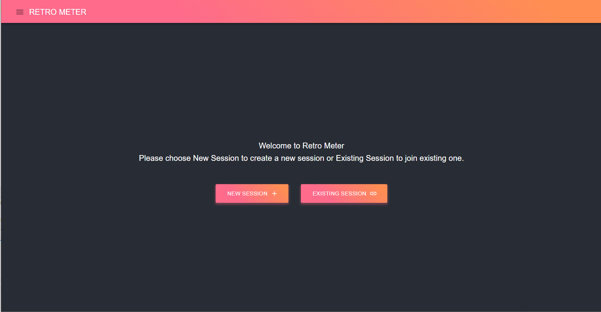
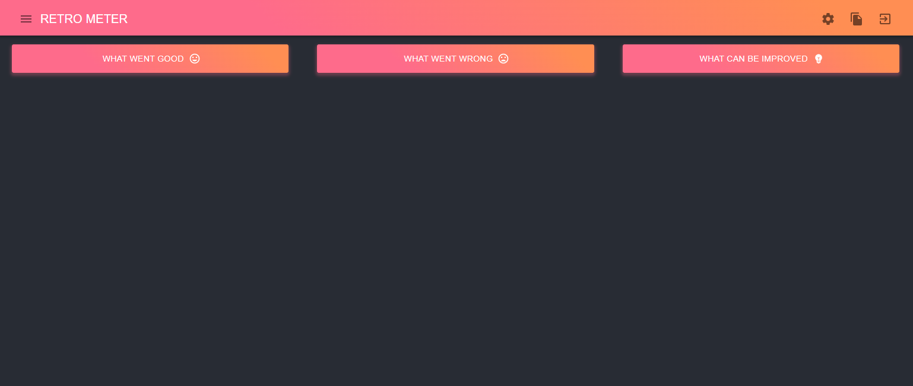
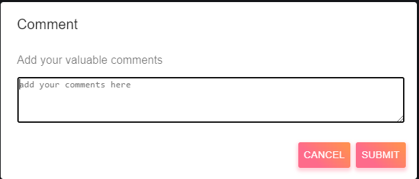
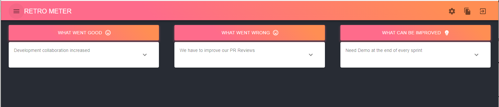
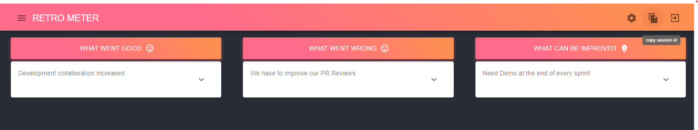
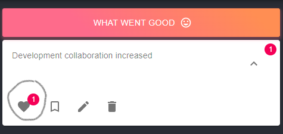
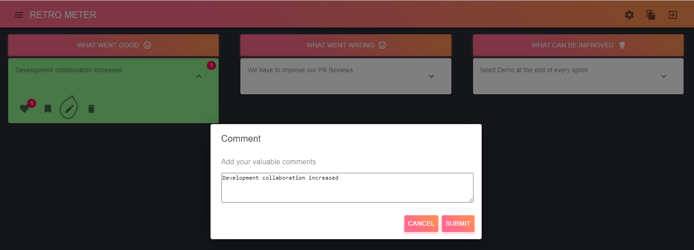
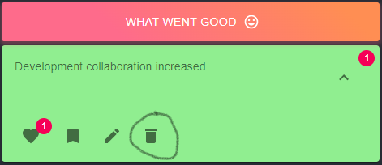
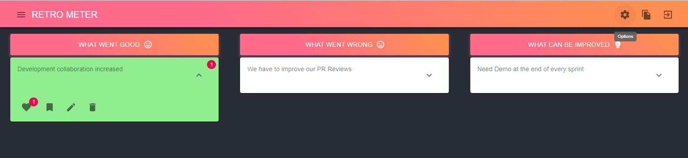
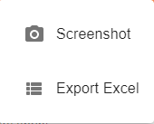

# RETRO-METER

## Retrospective 
Identify how to improve teamwork by reflecting on what worked, what didn’t, and why. Usually Retrospective sessions are conducted at the sprint ending or completion of a project milestone.

## Scope
This application facilitates retrospective sessions, that eases the overall process of conducting the retrospective.

## How to conduct
This application offers two entry points  
1. New Session
2. Existing Session

## New Session

We can start new retrospective session by clicking the "New Session" button on the home screen.  

Once you have created a new session, the main page will be shown as follows

In retrospective sessions we ought to capture three important categories of comments

1. What went good
2. What went wrong
3. What can be improved

These above things can be captured by just clicking on the same category buttons. By clicking any one of the category the application shows a comment input where we can enter the comments.

Adding a comment reflects in runtime to all the users joined in the same session

## Join Existing Session

Every session has a unique session id which can be copied by clicking the copy button on the right corner.

Using the copied session-id we can join the existing session by clicking the "EXISTING SESSION" button from home page.

## Actions
Expanding a comment added will show multiple useful actions.

### Like Comment

We can like the comment by clicking the heart button in the comment action, to unlike click the same button.

### Action Item

We can make any comment as action item by clicking the bookmark button, clicking the same button again removes the comment from action items.

### Edit Comment

We can edit the comment text by clicking the pencil button.

### Delete Comment

We can delete the comment by clicking the delete button from the actions.

## Options

This application provides Export(csv) and Screenshot(png) options to grab the current session details

